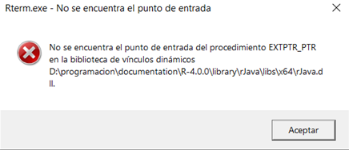
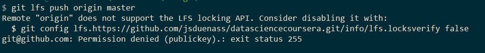
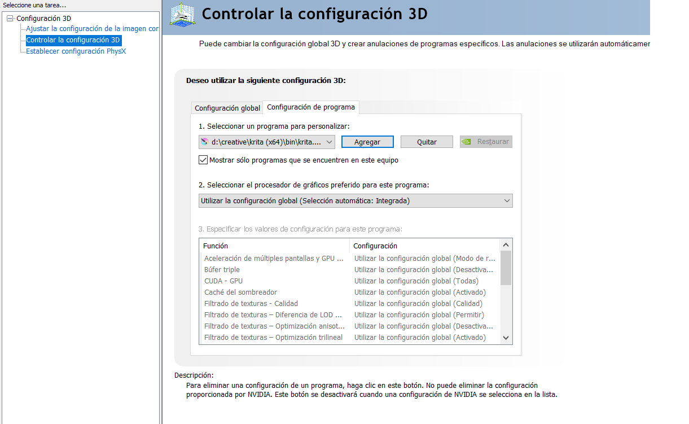

# knowlege base
A compact list of tools and strategies useful when working in IT.

## Inventory 
A full description of all of the hardware , software, licenses available at your disposal with all the information, description and specifications that might become in handy to have.

### System info


## Ticket System
The following is a ticket system design to document the debugging proccess used when encountering errors and misconfigurations in a daily use. This system is intended for personal use and might struggle to scale for more complex organizations. Some of the issues this system does not take into account and lack the capabilities to deal with can be found [here]().

### Setting up the rules
__Structure:__ Each ticket must have the following components: an identification code, a summary, an status and short description of the debuggin process. Some other components that become important in a complex organization but are not implemented in this particular system are the following: priority, date of filing, channel used to file, entity responsable, comments, feed back and costumer satisfaction.    

__identification code__: is an numberic code that uniquely identifies each ticket filed, it is composed of two parts: The __category__ part, a four digit number each one  representing a level, inspired by the Dewey Decimal Classification system (DDC) would ticket and __id number__ and 

Recategorize 
No ticket gets eleminated 


periodic archiving 

0000-00

\<OS\>


1. OS:
1 -> Windows
2 -> Linux
3 -> dual boot

2. Aplication type:
1 -> System 
2 -> Networking and Internet related
3 -> Programming tools
4 -> Ofimatic software 


### Ticket list

* __0100-01 SD card not writable:__ __solved__ unable to boot rasbain into the SD card it is not writable.

enable writable permissions. enter command line and run diskpart.  "did not solve the issue"

    attributes disk clear readonly

for security issues SD cards have a lock slide that limits the capabilitie to write into it. 

remove the SD card and unlock the slide.

* __1200-01 math equations not display in firefox browser:__ __solved__ addblockers can interference with mathajax capabilities. white list the mathjax extension.


* __1300-01 dll missing:__ __solved__ when openning Rstudio after a installing a new package ```xlsx``` and loading it through  ```library(xlsx)``` error rJava.dll missing. R version 4.0. 



register back the .dll file.  "did not solve the issue" 
    
    regsvr32 /u "D:/programacion/documentation/R-4.0.0/library/rJava/libs/x64/rJava.dll"

depurate the dll file. "not tried"

update R from version 4.0 version to 4.2, when loading the library   ```library(xlsx)``` a more clear error message is presented.
    
    error: Your java version is 14.  Need 1.5.0 or higher.

update java  "solved"

* __1300-02 git LSB SSH uncompatible__ 





* __1400-01 krita crash__ __solved__ krita would load and then suddenly close might be related with another Adobe bug which closses Ilustrator
check crash log 
`%LOCALAPPDATA%kritacrash.log`


> krita.exe caused an Access Violation at location 00007FFE282FDF5E in module nvwgf2umx.dll Reading from location 000000080000006C.

>AddrPC           Params

> 00007FFE282FDF5E 00000000033FEFB8 00000000005F9E80 0000000000000002  nvwgf2umx.dll!0xedf5e OpenAdapter12+0xe432e

The errors show that ` OpenAdapter12+0xe432e` is not recognize by the `nvwgf2umx.dll`  nvidia library which makes it incompatible with. remove it from the  krita application from NVIDIA control panel. the application would be process by the Intel GPU.


 

* __2100-01 sound__ __unsolved__ sub woffer not being used in ubuntu

* __2100-02 screen drivers__ __unsolved__
 from settigns -> about find the current graphics to be "NV11/ / Mesa inta Hd Graphics 530" graphic 
    ubuntu-drivers devices
    sudo ubuntu-drivers autoinstall

    sudo lshw -c display

[external source](https://www.linuxbabe.com/ubuntu/install-nvidia-driver-ubuntu-18-04)


* __2200-01 play netflix and amazon:__  __solved__ Both netflix and amazon prime are unable to play in ubuntu version: 2020.4 in firefox  version: 79.

In firefox enble DRM, from settings enable the DRM option, " this was a required but not suficient step".

install missing drivers
    sudo apt install ubuntu-restricted-extras

* __2100-01 used long path in terminal:__ __solved__ want to access some directories from terminal, but they have long path names makeing it unconfortable to work with them in the shell. 
use simbolik links to other the home directory (~) under a hidden folder name `paths` and load them into the shell configuration file `~/.bashr` 

``` 
    mkdir ~/.paths
    cd ~/.paths
    ln -s /media/jsds/Documentos/Documentos/codigo code
    ln -s /media/jsds/Documentos/Documentos/codigo/Google_IT_support support
    echo 'CDPATH=~/.paths' >> ~/.bashrc
    source ~/.bashrc
``` 

* __3100-01 mount NTF partition dual boot__

* __3300-01 git all files changed__ __unsolved__


## power shell
scprits has no permission, tempora comment profile.ps1

```
#region conda initialize
# !! Contents within this block are managed by 'conda init' !!
#(& "D:\programacion\anaconda\Scripts\conda.exe" "shell.powershell" "hook") | Out-String | Invoke-Expression
#endregion

```


## Reports


linux
battery report in ubuntu


processor architecture
instruction set

cross plataform capabilities 

Java writte once run everywhere

Arm is RISC (Reduced Instruction Set Computing) based while Intel (x86) is CISC (Complex Instruction Set Computing)